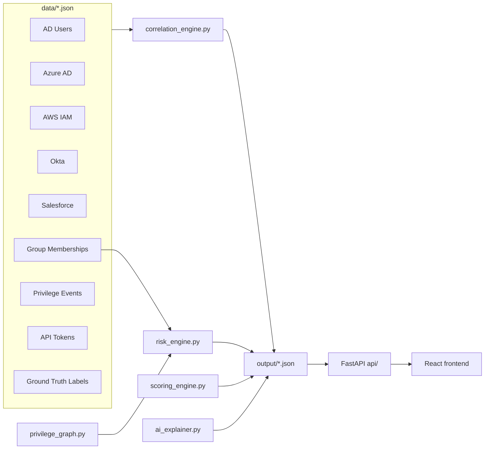
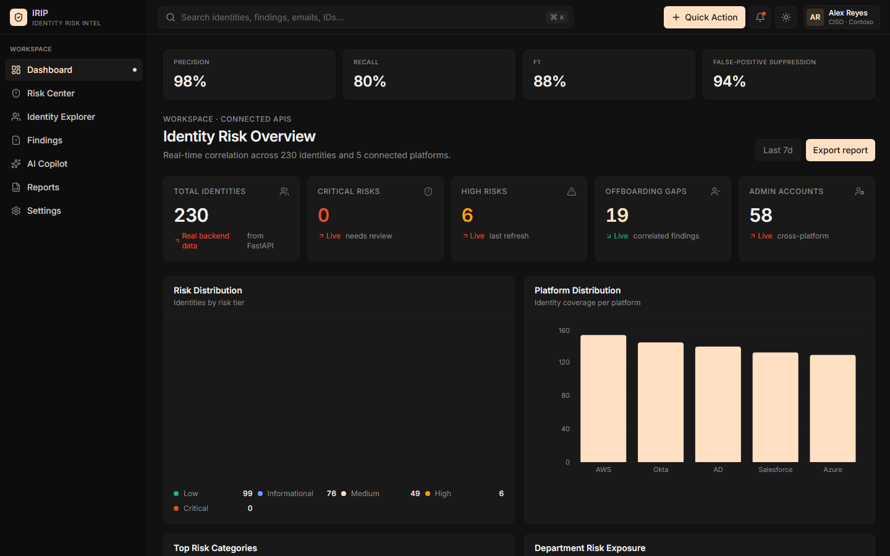
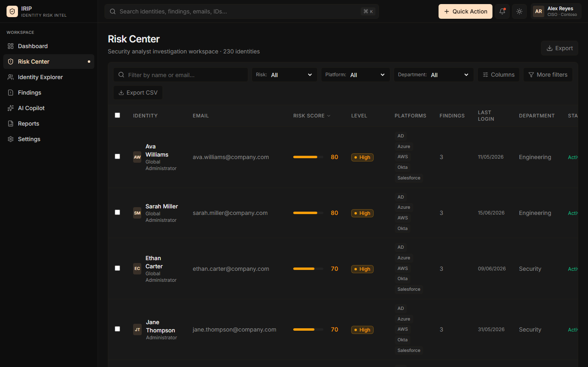
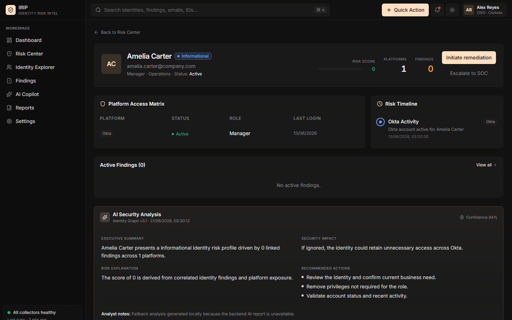
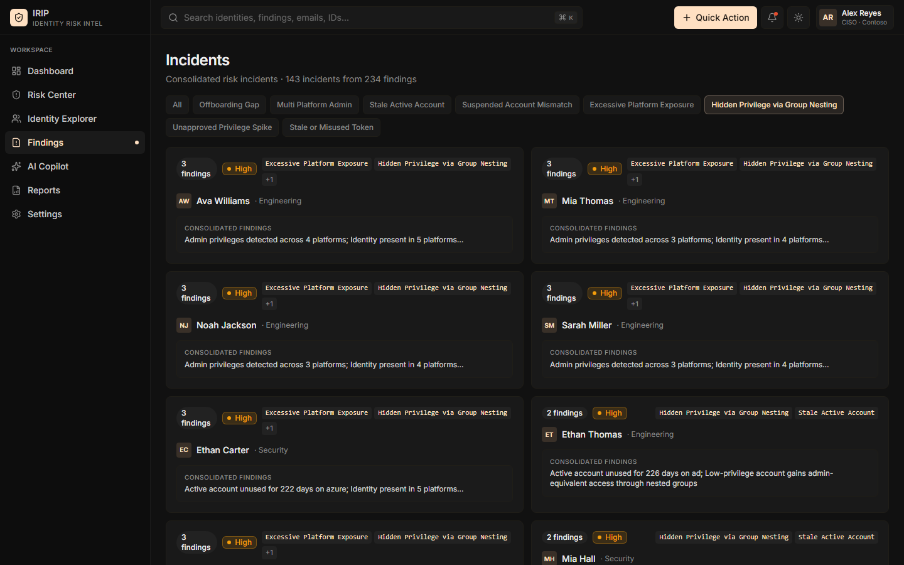
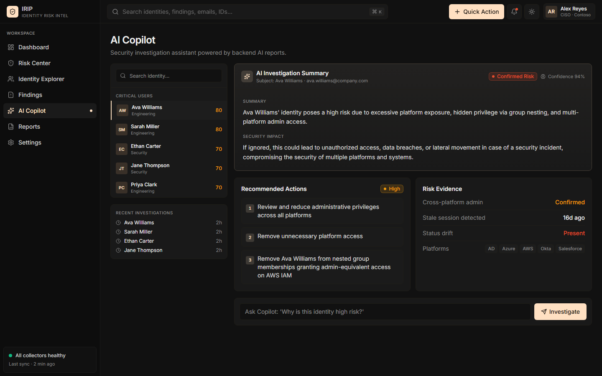
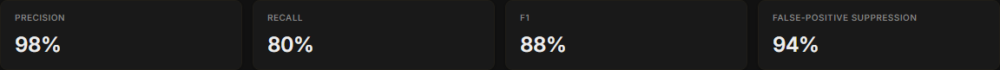

# Privilege Analyzer

> Cross-platform identity sprawl detection and privileged-access abuse analysis for enterprise IAM — correlate identities across AD, Azure AD, AWS IAM, Okta, and Salesforce, then score, explain, and remediate risk without a database.

[](https://www.python.org/)
[](https://fastapi.tiangolo.com/)
[](https://react.dev/)
[](https://tanstack.com/)
[](https://groq.com/)
[](./tests/)

**Repository:** [github.com/Mohiee661/privilege-analyzer](https://github.com/Mohiee661/privilege-analyzer)

---

## Problem Statement

Modern employees rarely live in a single directory. The same person often has accounts in Active Directory, Azure AD, AWS IAM, Okta, and SaaS tools like Salesforce — provisioned at different times, by different teams, with no unified lifecycle view. Offboarding in one system does not guarantee removal elsewhere. Privileged access can hide inside nested security groups while the UI still shows a low-privilege role. API tokens go stale or exceed their declared scope.

**Privilege Analyzer** solves this identity sprawl problem by correlating platform records into unified identities, traversing group inheritance to compute *effective* privilege, running eight deterministic detectors for common abuse patterns, scoring and consolidating alerts, and surfacing AI-generated narratives with self-evaluation metrics against a labeled synthetic ground-truth dataset.

---

## Key Features

### Cross-platform identity correlation
- Merges platform-specific user exports from five systems into **230 unified identities** using normalized email as the join key.
- Preserves per-platform account status, role, last login, MFA, and documented `risk_context` exceptions on each unified record.

### Effective privilege calculator (nested group inheritance)
- `services/privilege_graph.py` loads `data/group_memberships.json` and builds a per-platform group graph.
- For any email + platform, it walks **upward** through `parent_group_id` links, collecting every `grants_role` along the lineage.
- Roles are deduplicated while preserving first-seen order.
- This powers the **Hidden Privilege via Group Nesting** detector: a user whose *stated* role is low-privilege but whose inherited groups grant admin-equivalent access is flagged even when the account record itself looks benign.

### Eight rule-based risk detectors
All detection is deterministic — no trained ML classifier generates findings.

| Rule | What it catches |
|------|-----------------|
| **OFFBOARDING_GAP** | At least one platform account is `disabled` while another for the same person remains `active`. |
| **MULTI_PLATFORM_ADMIN** | Admin-equivalent roles on two or more platforms (e.g. Global Administrator, Super Admin). |
| **STALE_ACTIVE_ACCOUNT** | Account still `active` but `last_login` older than 180 days. |
| **SUSPENDED_ACCOUNT_MISMATCH** | `suspended` on one platform while still `active` on another. |
| **EXCESSIVE_PLATFORM_EXPOSURE** | Same identity present on four or more platforms. |
| **HIDDEN_PRIVILEGE_VIA_GROUP_NESTING** | Stated role is low-privilege, but `effective_privilege()` resolves admin access through nested groups on that platform. |
| **UNAPPROVED_PRIVILEGE_SPIKE** | Three or more privilege-change events within seven days with no `approved_by` value. |
| **STALE_OR_MISUSED_TOKEN** | API token not rotated in 365+ days, or read-only scope observed making write calls. |

### Risk scoring with context-aware dampening
- `services/scoring_engine.py` assigns weighted points per finding type (e.g. OFFBOARDING_GAP = 40, HIDDEN_PRIVILEGE = 35).
- When a finding overlaps a platform that has a documented `risk_context` justification, that finding's contribution is **halved** (×0.5) — the signal is dampened, not deleted, so periodic re-verification is still required.
- Scores cap at 100 and map to risk levels: CRITICAL, HIGH, MEDIUM, LOW.

### AI-generated risk narratives (Groq)
- `services/ai_explainer.py` sends correlated identity + findings context to Groq (`llama-3.3-70b-versatile`, fallback `llama-3.1-8b-instant`).
- Produces executive summary, security impact, recommended actions, and a **`confidence_label`**:
  - `likely_true_positive` — no documented exception on any account.
  - `likely_false_positive_pending_review` — at least one account carries `risk_context`.
- Falls back to deterministic local text when Groq is unavailable; reports are cached in `output/ai_report_cache.json`.

### Alert consolidation
- `consolidate_findings()` groups raw findings by `person_id`, then optionally clusters department-level incidents when multiple people share the same risk type within a seven-day window.
- **Current result:** 234 raw findings → **143 incidents** (**38.9%** alert-volume reduction).¹

### Self-evaluation against ground truth
- `scripts/evaluate_accuracy.py` compares risk profiles to `data/ground_truth_labels.json` (230 labeled identities, including intentional false-positive traps).
- **Current metrics:** Precision **98.0%**, Recall **80.2%**, F1 **88.2%**, false-positive trap suppression **93.8%** (30 of 32 traps correctly not over-flagged).¹

### Platform-specific remediation guidance
- Each finding includes a `remediation_steps` array with actionable text derived from its evidence (e.g. *"Revoke AWS IAM Administrator role"*, *"Remove from nested group memberships granting admin-equivalent access on Azure AD"*).

### Thirteen scripted demo scenarios
- `data/demo_scenarios.json` defines guaranteed live-demo walkthroughs: Ghost Employee, Multi-System Administrator, Dormant Administrator, Suspended User Mismatch, Excessive Platform Exposure, Privilege Creep Contractor, Shadow IT Operator, Dormant SaaS Admin, Reinstated Access Risk, All-Platforms Power User, **Hidden Admin via Nested Group**, Unapproved Privilege Spike, and Stale Token Misuse.

### CSV / PDF export
- `reports/executive_report_generator.py` writes `exports/csv/` (risk profiles, findings, AI reports) and `exports/pdf/executive_report.pdf`.
- The frontend Reports page also exports an executive-summary CSV and supports browser print-to-PDF.

---

## Architecture



**Pipeline stages**

1. **`services/correlation_engine.py`** — load platform JSON, normalize emails, emit `output/unified_identities.json`.
2. **`services/risk_engine.py`** — run eight detectors + remediation text generation → `output/risk_findings.json`.
3. **`services/scoring_engine.py`** — weighted scores + dampening → `output/risk_profiles.json`.
4. **`services/ai_explainer.py`** — Groq narratives + cache → `output/ai_reports.json`.
5. **`api/main.py`** — serve artifacts over HTTP.
6. **`frontend/`** — TanStack Start dashboard for analysts and executives.

**Why file-based (no database)?**
This is a hackathon / demo-first architecture: judges can inspect every artifact on disk, re-run pipelines with `git diff`-able outputs, and deploy without provisioning Postgres or Elasticsearch. The trade-off is no real-time streaming ingestion or multi-tenant persistence — appropriate for synthetic evaluation, not production SOAR replacement.

See also [docs/ARCHITECTURE.md](./docs/ARCHITECTURE.md) and [docs/DATA_DICTIONARY.md](./docs/DATA_DICTIONARY.md).

---

## Tech Stack

### Backend (`requirements.txt`)
| Package | Role |
|---------|------|
| **FastAPI** | HTTP API framework |
| **uvicorn** | ASGI server |
| **pydantic** | Request/response schemas |
| **groq** | LLM client for AI copilot |
| **python-dotenv** | Environment variable loading |
| **reportlab** | PDF executive report generation |
| **pytest** + **httpx** | Test suite |

### Frontend (`frontend/package.json`)
| Package | Role |
|---------|------|
| **React 19** | UI library |
| **Vite 8** | Build tool / dev server |
| **TanStack Router + TanStack Start** | File-based routing and SSR |
| **TanStack React Query** | Server-state caching |
| **Tailwind CSS 4** | Styling |
| **Radix UI** | Accessible primitives |
| **Recharts** | Dashboard charts |
| **Lucide React** | Icons |
| **Zod** + **React Hook Form** | Form validation |
| **TypeScript 5.8** | Type safety |

---

## Screenshots

Captured from a live local run (backend on `:8000`, frontend on `:3000`) after executing the full detection pipeline.

### Dashboard — identity risk overview



*Executive dashboard with live metrics, risk distribution pie chart, and platform exposure bars.*

### Risk Center — prioritized identity list



*Filterable, sortable risk register with cross-platform context and CSV export.*

### Identity detail — cross-platform account matrix



*Unified identity view with platform access matrix, timeline, findings, and AI security analysis.*

### Hidden privilege via group nesting



*Consolidated incidents filtered to nested-group hidden admin detections — the most technically interesting detector.*

### AI Copilot — narrative with confidence label



*Groq-generated executive summary, security impact, recommended actions, and `confidence_label` badge.*

### Self-evaluation scorecard



*Live precision/recall/F1 and trap-suppression metrics pulled from `/api/v1/accuracy`.*

---

## Getting Started

### Prerequisites
- Python 3.12+
- Node.js 20+ and npm
- (Optional) Groq API key for live AI narratives

### 1. Clone and install

```bash
git clone https://github.com/Mohiee661/privilege-analyzer.git
cd privilege-analyzer

pip install -r requirements.txt

cd frontend
npm install
cd ..
```

### 2. Configure environment

**Root `.env`** (copy from `.env.example`):

```env
GROQ_API_KEY=your_groq_key_here
CORS_ORIGINS=http://localhost:3000,http://127.0.0.1:3000,https://*.vercel.app
```

**Frontend `frontend/.env`** (copy from `frontend/.env.example`):

```env
VITE_API_BASE_URL=/api/v1
NEXT_PUBLIC_API_URL=http://localhost:8000
```

`VITE_API_BASE_URL` is used by the Vite dev proxy (`/api` → `http://127.0.0.1:8000`). `NEXT_PUBLIC_API_URL` is the direct backend URL for SSR and production builds.

### 3. Generate pipeline artifacts

```bash
python services/correlation_engine.py
python services/risk_engine.py
python services/scoring_engine.py
python services/ai_explainer.py   # optional; uses GROQ_API_KEY or falls back locally
```

### 4. Run the servers

**Backend** (from repo root):

```bash
python -m uvicorn api.main:app --reload --host 127.0.0.1 --port 8000
```

**Frontend** (from `frontend/`):

```bash
npm run dev
```

Open [http://127.0.0.1:3000](http://127.0.0.1:3000). API docs: [http://127.0.0.1:8000/docs](http://127.0.0.1:8000/docs).

---

## Running the Detection Pipeline

Run these standalone to see CLI output without the UI:

| Command | Output |
|---------|--------|
| `python services/correlation_engine.py` | Correlation report — account counts per platform, 230 unified identities → `output/unified_identities.json` |
| `python services/risk_engine.py` | Risk report — per-detector finding counts, 234 total → `output/risk_findings.json` |
| `python services/scoring_engine.py` | Top risks + analytics — level distribution, average score → `output/risk_profiles.json` |
| `python services/ai_explainer.py` | AI security report preview for top identities → `output/ai_reports.json` |
| `python scripts/evaluate_accuracy.py` | Precision / recall / F1 / trap suppression table |
| `python reports/executive_report_generator.py` | Executive summary + `exports/csv/*.csv` + `exports/pdf/executive_report.pdf` |

**Current pipeline snapshot** (after full run):¹

| Detector | Findings |
|----------|----------|
| OFFBOARDING_GAP | 19 |
| MULTI_PLATFORM_ADMIN | 58 |
| STALE_ACTIVE_ACCOUNT | 16 |
| SUSPENDED_ACCOUNT_MISMATCH | 13 |
| EXCESSIVE_PLATFORM_EXPOSURE | 88 |
| HIDDEN_PRIVILEGE_VIA_GROUP_NESTING | 19 |
| UNAPPROVED_PRIVILEGE_SPIKE | 14 |
| STALE_OR_MISUSED_TOKEN | 7 |
| **Total** | **234** |

Risk level distribution: 0 Critical · 6 High · 49 Medium · 99 Low · average score 21.8.

---

## API Reference

Base URL: `http://localhost:8000` · Prefix: `/api/v1`

| Method | Path | Description |
|--------|------|-------------|
| `GET` | `/health` | Liveness probe — returns `{"status": "healthy"}` |
| `GET` | `/api/v1/dashboard` | Summary counts: total identities, critical/high risks, offboarding gaps, admin accounts |
| `GET` | `/api/v1/analytics` | Risk distribution, platform distribution, top risk types |
| `GET` | `/api/v1/accuracy` | Self-evaluation metrics: precision, recall, F1, trap suppression rate |
| `GET` | `/api/v1/identities` | Paginated unified identity list (`page`, `page_size`) |
| `GET` | `/api/v1/identities/{person_id}` | Single identity with per-platform accounts |
| `GET` | `/api/v1/findings` | All findings; optional `?risk_type=` filter |
| `GET` | `/api/v1/incidents` | Consolidated incidents (person-level + department clusters) |
| `GET` | `/api/v1/risks` | Risk profiles; optional `?level=HIGH` filter |
| `GET` | `/api/v1/risks/{person_id}` | Risk profile detail with findings and optional AI report |
| `GET` | `/api/v1/ai-reports` | All cached AI reports (generates if missing) |
| `GET` | `/api/v1/ai-reports/{person_id}` | AI report for one identity (generates on demand) |
| `GET` | `/api/v1/search` | Search identities by `?q=` (person_id, name, or email) |

Interactive OpenAPI: `/docs` and `/redoc`.

---

## Dataset

The synthetic corpus models a 230-person organization across five platforms (**697 total accounts**):

| File | Contents |
|------|----------|
| `ad_users.json`, `azure_users.json`, `aws_users.json`, `okta_users.json`, `salesforce_users.json` | Per-platform identity records |
| `group_memberships.json` | Nested groups with `grants_role` and `parent_group_id` |
| `privilege_events.json` | Role-change audit trail with optional `approved_by` |
| `api_tokens.json` | Token rotation and scope-misuse telemetry |
| `login_events.json`, `offboarding_records.json` | Activity and lifecycle events |
| `ground_truth_labels.json` | Per-email labels for self-evaluation |
| `demo_scenarios.json` | 13 scripted demo narratives |

**Anomaly categories baked into ground truth** include offboarding gaps, multi-platform admins, nested-group hidden admins, dormant admins, privilege escalation, suspended mismatches, orphaned service accounts, token abuse, and **legitimate_trap** records (documented safe exceptions to test false-positive suppression).

**Labeling approach:** Each identity receives `is_anomalous`, `category`, and `is_false_positive_trap` flags. Evaluation treats a profile as "predicted risky" when `risk_level` is HIGH/CRITICAL **or** `score ≥ 25`, then computes precision/recall/F1 and trap suppression against those labels.

---

## Testing

```bash
python -m pytest
```

**Current result:** **58 passed**, 0 failed.¹

Test modules cover data loading, correlation, all eight detectors, privilege graph traversal, scoring dampening, AI explainer fallbacks, executive report generation, accuracy evaluation, and FastAPI endpoint contracts.

---

## Project Structure

```text
privilege-analyzer/
├── api/                 FastAPI app, routers, Pydantic schemas, CORS config
├── data/                Synthetic source datasets (5 platforms + telemetry)
├── docs/                Architecture, data dictionary, screenshots
├── exports/             Generated CSV and PDF exports
├── frontend/            React / TanStack Start analyst dashboard
├── models/              Backend dataclasses (Finding, RiskProfile, AIReport)
├── output/              Pipeline artifacts — JSON source of truth
├── prompts/             Groq prompt templates
├── reports/             Executive report and export utilities
├── scripts/               Accuracy evaluation and data generation helpers
├── services/            Correlation, risk detection, scoring, AI, privilege graph
├── tests/               Pytest suite (58 tests)
├── .env.example         Backend environment template
├── Dockerfile           Container build for deployment
├── render.yaml          Render.com backend deploy config
└── requirements.txt     Python dependencies
```

---

## Future Improvements

1. **Live platform connectors** — Replace static JSON with read-only SCIM / Graph / AWS IAM / Okta API ingestion while keeping the file-based pipeline as an offline analysis mode.
2. **Remediation workflow** — Track incident status (open → in progress → resolved) and link each finding to a ticketing webhook (Jira/ServiceNow).
3. **Temporal correlation** — Use `login_events.json` timestamps in detectors (e.g. flag logins after offboarding date) rather than only current-state snapshots.
4. **Authentication and RBAC** — Add API key or OIDC auth before exposing beyond local demo, with role-scoped views for SOC vs. executive users.

---

## Deployment Notes

**Render (backend):** See `render.yaml`. Startup runs the full pipeline then launches uvicorn. Set `GROQ_API_KEY` and `CORS_ORIGINS`.

**Vercel (frontend):** Set `NEXT_PUBLIC_API_URL` to your Render service URL.

---

## License & Credits

**Author:** [Mohith Vasamsetti](https://github.com/CyberEnthusiastic) · Part of the AI Security Projects suite.

See [LICENSE](./LICENSE) and [NOTICE](./NOTICE) for terms. See [SECURITY.md](./SECURITY.md) for vulnerability reporting.

---

### Footnotes

¹ **Metrics generated:** 20 June 2026 — from `python services/correlation_engine.py`, `python services/risk_engine.py`, `python services/scoring_engine.py`, `python scripts/evaluate_accuracy.py`, and `python -m pytest` on the current `main` branch.
