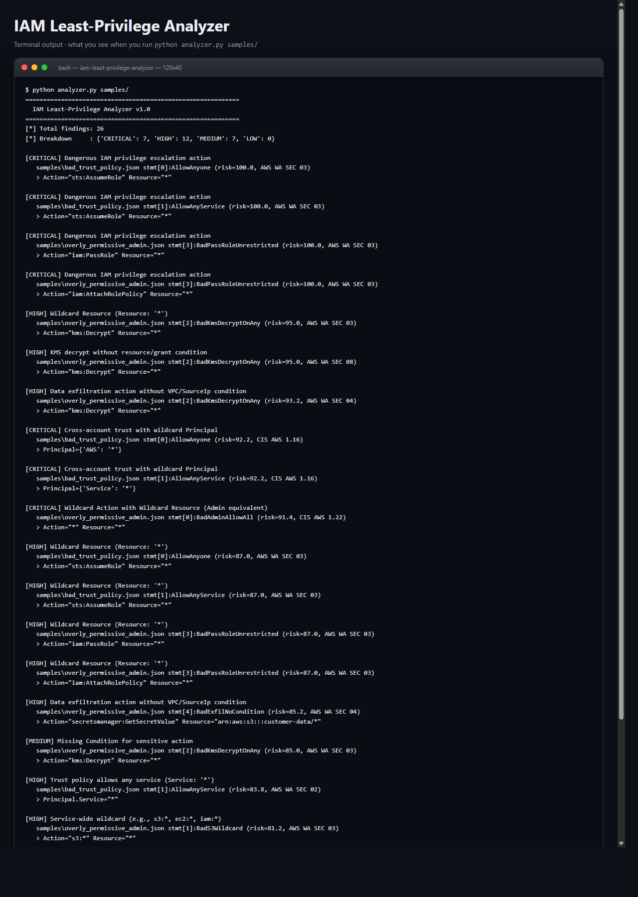
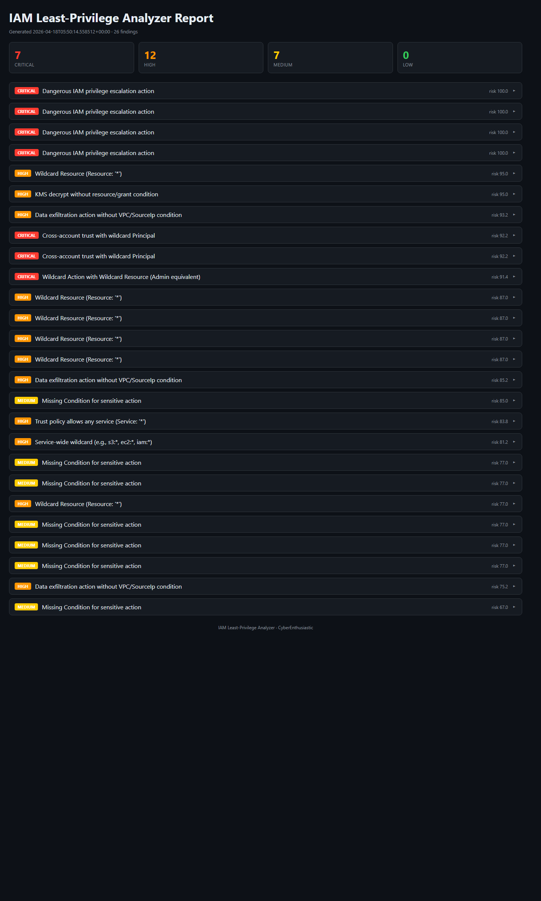

# IAM Least-Privilege Analyzer

> **Detect over-privileged AWS IAM policies in seconds — CIS-mapped, privilege escalation aware, zero dependencies.**
> A free, self-hosted alternative to AWS Access Analyzer, Cloudsplaining, and ermetic for teams that want IAM least-privilege enforcement without the enterprise price tag.

[](./LICENSE)
[](https://www.python.org/downloads/)
[](./.github/workflows/iam.yml)
[](https://www.cisecurity.org/benchmark/amazon_web_services)

---

## What it does (in one screenshot of terminal output)

```
============================================================
  IAM Least-Privilege Analyzer v1.0
============================================================
[*] Total findings: 11
[*] Breakdown     : {'CRITICAL': 4, 'HIGH': 5, 'MEDIUM': 2, 'LOW': 0}

[CRITICAL] Wildcard Action with Wildcard Resource (Admin equivalent)
   samples/overly_permissive_admin.json stmt[0]:BadAdminAllowAll (risk=99.4, CIS AWS 1.22)
   > Action="*" Resource="*"

[CRITICAL] Cross-account trust with wildcard Principal
   samples/bad_trust_policy.json stmt[0]:AllowAnyone (risk=97.2, CIS AWS 1.16)
   > Principal={'AWS': '*'}

[CRITICAL] Dangerous IAM privilege escalation action
   samples/overly_permissive_admin.json stmt[3]:BadPassRoleUnrestricted (risk=95.8, AWS WA SEC 03)
   > Action="iam:PassRole" Resource="*"
```

And opens this interactive dark-mode HTML report with per-finding drill-down:
- Severity chip &middot; Rule ID &middot; Risk score &middot; Action &middot; Resource &middot; CIS mapping &middot; Remediation &middot; Suggested fix

---

## Screenshots (ran locally, zero setup)

**Terminal output** - exactly what you see on the command line:



**Interactive HTML dashboard** - opens in any browser, dark-mode, filterable:



Both screenshots are captured from a real local run against the bundled `samples/` directory. Reproduce them with the quickstart commands below.

---

## Why you want this

| | **IAM Least-Privilege Analyzer** | AWS Access Analyzer | Cloudsplaining | Ermetic |
|---|---|---|---|---|
| **Price** | Free (MIT) | Free (tied to account) | Free (OSS) | $$$$ |
| **Runtime deps** | **None** — pure stdlib | AWS console | Python + graphviz | SaaS |
| **Install time** | `git clone && python analyzer.py` | IAM role setup | `pip install cloudsplaining` | Onboarding call |
| **Offline / air-gapped** | Yes | No | Yes | No |
| **Privilege-escalation rules** | 12 built-in | Limited | 40+ | Yes |
| **Trust policy review** | Yes | Yes | Partial | Yes |
| **Interactive HTML report** | Bundled | Console only | Separate step | SaaS |
| **ML-style risk scoring** | Yes (0-100) | No | No | Proprietary |
| **Extend with Python** | 10 lines | No | Python | No |

---

## 60-second quickstart (Windows, macOS, Linux)

```bash
# 1. Clone
git clone https://github.com/CyberEnthusiastic/iam-least-privilege-analyzer.git
cd iam-least-privilege-analyzer

# 2. Run it (zero install - pure Python 3.8+ stdlib)
python analyzer.py samples/

# 3. Open the HTML report
start reports/iam_report.html      # Windows
open  reports/iam_report.html      # macOS
xdg-open reports/iam_report.html   # Linux
```

### Alternative: one-command installer

```bash
# Linux / macOS / WSL / Git Bash
./install.sh

# Windows PowerShell
.\install.ps1
```

### Alternative: Docker

```bash
docker build -t iam-analyzer .
docker run --rm -v "$PWD/policies:/app/policies" iam-analyzer analyzer.py policies/
```

---

## What it detects (12 rule classes)

| ID | Rule | Severity | CIS / AWS Mapping |
|----|------|----------|-------------------|
| IAM-001 | Wildcard Action with Wildcard Resource (admin-equivalent) | CRITICAL | CIS AWS 1.22 |
| IAM-002 | Wildcard Action `"Action": "*"` | HIGH | CIS AWS 1.22 |
| IAM-003 | Wildcard Resource `"Resource": "*"` | HIGH | AWS WA SEC 03 |
| IAM-004 | Service-wide wildcard (e.g. `s3:*`, `iam:*`) | HIGH | AWS WA SEC 03 |
| IAM-005 | Privilege escalation action (iam:PassRole, iam:Put*Policy, iam:CreateAccessKey) | CRITICAL | AWS WA SEC 03 |
| IAM-006 | `NotAction` used with `Effect: Allow` (deny-list antipattern) | MEDIUM | AWS WA SEC 03 |
| IAM-007 | Missing Condition block on sensitive action | MEDIUM | AWS WA SEC 03 |
| IAM-008 | Data-exfiltration action without VPC/SourceIp condition | HIGH | AWS WA SEC 04 |
| IAM-009 | `kms:Decrypt` without resource/grant scoping | HIGH | AWS WA SEC 08 |
| IAM-010 | Cross-account trust with wildcard Principal | CRITICAL | CIS AWS 1.16 |
| IAM-011 | Inline policy on a user (should use groups) | LOW | CIS AWS 1.15 |
| IAM-012 | Trust policy allows any AWS service (`Service: "*"`) | HIGH | AWS WA SEC 02 |

See `IAM_RULES` and `PRIVESC_ACTIONS` in `analyzer.py` for the full definitions.

---

## How the risk scorer works

`IAMRiskScorer` blends signals to produce a 0-100 score per finding:

- **Pattern confidence** (base 60) - each rule ships with 0.70-0.99 hand-calibrated confidence
- **Missing Condition** (+12) - no MFA / SourceIp / VPC condition on a sensitive action
- **Sensitive service** (+10) - iam, kms, sts, secretsmanager, organizations
- **Exfiltration action** (+8) - s3:GetObject, secretsmanager:GetSecretValue, etc.
- **Wildcard resource** (+8) - `Resource: "*"` with any non-wildcard action
- **Severity bonus** - +12 CRITICAL, +6 HIGH, +2 MEDIUM

A plain `kms:Decrypt` on a single key scores ~65, but `kms:Decrypt` with `Resource: "*"` and no condition jumps to ~95. Context > pattern alone.

---

## Scan your own policies

```bash
# Scan a single policy JSON
python analyzer.py path/to/role-policy.json

# Scan a directory of policy files
python analyzer.py path/to/terraform/policies/

# Custom output paths
python analyzer.py policies/ -o out.json --html out.html
```

The analyzer understands three input shapes:
1. **Raw policy document** - `{"Version":"2012-10-17","Statement":[...]}`
2. **Wrapper with `PolicyDocument`** - output of `aws iam get-policy-version`
3. **Role document with `AssumeRolePolicyDocument`** - trust policies

---

## CI/CD integration (fail the build on CRITICAL findings)

Add this to `.github/workflows/iam.yml`:

```yaml
- name: Run IAM Analyzer
  run: python analyzer.py terraform/iam/

- name: Fail on CRITICAL
  run: |
    python -c "
    import json, sys
    r = json.load(open('reports/iam_report.json'))
    if r['summary']['by_severity']['CRITICAL'] > 0:
        print('CRITICAL IAM findings detected')
        sys.exit(1)
    "
```

---

## Extending the rule engine

Add a new rule to `IAM_RULES`:

```python
{
    "id": "IAM-013",
    "name": "EC2 full access without tag condition",
    "severity": "HIGH",
    "confidence": 0.85,
    "cis": "AWS WA SEC 03",
    "remediation": "Scope ec2:* to resources with aws:ResourceTag/env=dev condition.",
},
```

Then add matching logic in `analyze_statement()`. No YAML, no plugins.

---

## Project layout

```
iam-least-privilege-analyzer/
|-- analyzer.py           # main analyzer + 12 rules + risk scorer
|-- report_generator.py   # dark-mode HTML report
|-- samples/              # intentionally bad policies for demos
|   |-- overly_permissive_admin.json
|   |-- bad_trust_policy.json
|   `-- good_least_privilege.json
|-- reports/              # output (gitignored)
|-- Dockerfile            # containerized runs
|-- install.sh            # one-command installer (Linux/Mac/WSL)
|-- install.ps1           # one-command installer (Windows)
|-- requirements.txt      # empty - pure stdlib
|-- README.md             # this file
|-- LICENSE               # MIT
|-- NOTICE                # attribution
|-- SECURITY.md           # vulnerability disclosure policy
`-- CONTRIBUTING.md       # how to add rules / send PRs
```

---

## Roadmap

- [ ] Parse AWS Terraform state (`terraform show -json`) directly
- [ ] CloudTrail-driven "unused permissions" detector
- [ ] SCP (Service Control Policy) analysis for AWS Organizations
- [ ] SARIF output for GitHub Code Scanning
- [ ] Integration with IAM Access Analyzer findings

## License

MIT. See [LICENSE](./LICENSE) and [NOTICE](./NOTICE).

## Security

Responsible disclosure policy: see [SECURITY.md](./SECURITY.md).

## Contributing

PRs welcome! See [CONTRIBUTING.md](./CONTRIBUTING.md) for the quick path from fork to merged PR.

---

Built by **[Mohith Vasamsetti (CyberEnthusiastic)](https://github.com/CyberEnthusiastic)** as part of the [AI Security Projects](https://github.com/CyberEnthusiastic?tab=repositories) suite - a set of zero-dependency, commercial-grade security tools for engineers and teams who want serious security without serious SaaS bills.
